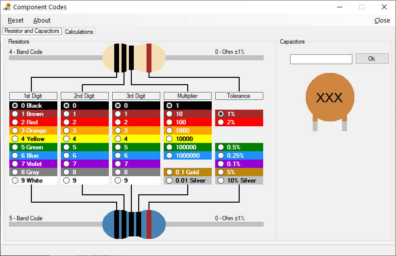

# ComponentCodes
- Version: 1.0
- Target: Windows
- Created: Fri 03 Jun 2011 in VS 2008

## Change Log
| Version | Changes         |
| ------- | --------------- |
| 1.0     | Initial release |

## Description
A program to work out Resistor and Capacitor codes

(Note: I wrote this years ago it maybe buggy)

